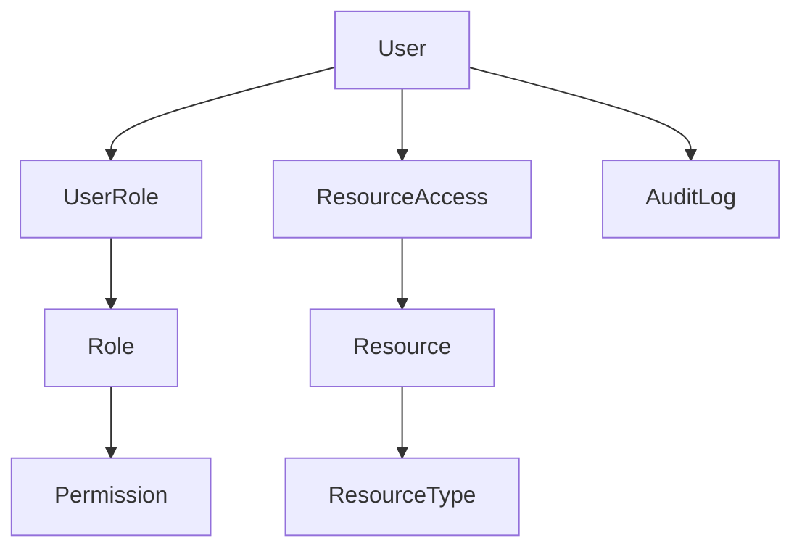
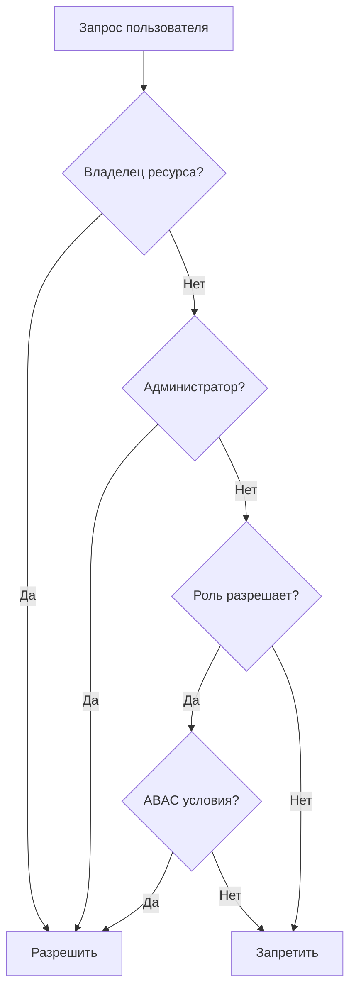

# 🔐 Custom Authentication & Authorization System (RBAC + ABAC)


Полнофункциональная система аутентификации и авторизации с собственной
реализацией управления доступом на основе гибридной модели\
**RBAC (Role-Based Access Control) + ABAC (Attribute-Based Access
Control)**.

------------------------------------------------------------------------

## 📋 Содержание

-   [Особенности](#особенности)
-   [Архитектура системы](#архитектура-системы)
-   [Быстрый старт](#быстрый-старт)
-   [API](#api)
-   [Примеры запросов](#примеры-запросов)
-   [Тестовые пользователи](#тестовые-пользователи)
-   [Тестирование](#тестирование)
-   [Структура проекта](#структура-проекта)
-   [Зависимости](#зависимости)

------------------------------------------------------------------------

## ✨ Особенности

### ✅ Реализовано

-   Кастомная JWT-аутентификация\
-   Гибкая авторизация (RBAC + ABAC)\
-   Мягкое удаление пользователей\
-   Mock бизнес-логика (проекты и документы)\
-   Полный API для управления доступом\
-   Обработка ошибок 401 / 403\
-   Административный API

### 🔧 Технические особенности

-   Не используется `django.contrib.auth.User`\
-   Собственная модель пользователя\
-   JWT refresh + blacklist\
-   Валидация сложности паролей

------------------------------------------------------------------------

## 🏗 Архитектура системы

### 📊 Модель данных



------------------------------------------------------------------------

### 🔐 Логика проверки доступа



------------------------------------------------------------------------

## 🚀 Быстрый старт

``` bash
git clone <repository-url>
cd AUTH_SYS

python -m venv venv
source venv/bin/activate  

pip install -r requirements.txt

./setup_postgres_complete.sh

cp .env.example .env

python manage.py migrate
python create_test_data.py

python manage.py runserver 8080
```

------------------------------------------------------------------------

## 📡 API

### 🔑 Аутентификация (`/api/auth/`)

  Метод    Endpoint     Описание
  -------- ------------ -------------------
  POST     /register/   Регистрация
  POST     /login/      JWT вход
  POST     /logout/     Выход
  POST     /refresh/    Обновление токена
  GET      /profile/    Профиль
  PATCH    /profile/    Обновление
  DELETE   /profile/    Мягкое удаление

### 👥 Администрирование

-   `GET /api/auth/roles/`
-   `GET /api/auth/permissions/`
-   `GET /api/auth/user-roles/`

### 📊 Бизнес-логика

-   `GET /api/projects/`
-   `POST /api/projects/create/`
-   `GET /api/documents/`
-   `GET /api/dashboard/`

### 🚫 Демонстрация ошибок

-   `GET /api/demo/access/?type=401`
-   `GET /api/demo/access/?type=403`

------------------------------------------------------------------------

## 📌 Примеры запросов

Базовый URL:

    http://localhost:8080

------------------------------------------------------------------------

### 🔐 Регистрация

``` bash
curl -X POST http://localhost:8080/api/auth/register/   -H "Content-Type: application/json"   -d '{
    "email": "test_user@example.com",
    "password": "TestPass123!",
    "password2": "TestPass123!",
    "first_name": "Тест",
    "last_name": "Пользователь"
  }'
```

------------------------------------------------------------------------

### 🔑 Логин

``` bash
curl -X POST http://localhost:8080/api/auth/login/   -H "Content-Type: application/json"   -d '{
    "email": "user1@example.com",
    "password": "User123!"
  }'
```

------------------------------------------------------------------------

### 🔄 Refresh токена

``` bash
curl -X POST http://localhost:8080/api/auth/refresh/   -H "Content-Type: application/json"   -d '{
    "refresh": "REFRESH_TOKEN"
  }'
```

------------------------------------------------------------------------

### 🚪 Logout

``` bash
curl -X POST http://localhost:8080/api/auth/logout/   -H "Authorization: Bearer ACCESS_TOKEN"   -H "Content-Type: application/json"   -d '{
    "refresh": "REFRESH_TOKEN"
  }'
```

------------------------------------------------------------------------

### 👤 Профиль

``` bash
curl -X GET http://localhost:8080/api/auth/profile/   -H "Authorization: Bearer ACCESS_TOKEN"
```

``` bash
curl -X PATCH http://localhost:8080/api/auth/profile/   -H "Authorization: Bearer ACCESS_TOKEN"   -H "Content-Type: application/json"   -d '{
    "first_name": "Обновлённое",
    "last_name": "Имя"
  }'
```

------------------------------------------------------------------------

### 📊 Проекты

``` bash
curl -X GET http://localhost:8080/api/projects/   -H "Authorization: Bearer ACCESS_TOKEN"
```

``` bash
curl -X POST http://localhost:8080/api/projects/create/   -H "Authorization: Bearer ACCESS_TOKEN"   -H "Content-Type: application/json"   -d '{
    "name": "Проект менеджера",
    "description": "Создан менеджером"
  }'
```

------------------------------------------------------------------------

### 📂 Документы

``` bash
curl -X GET http://localhost:8080/api/documents/   -H "Authorization: Bearer ACCESS_TOKEN"
```

``` bash
curl -X GET http://localhost:8080/api/documents/550e8400-e29b-41d4-a716-446655440001/download/   -H "Authorization: Bearer ACCESS_TOKEN"
```

------------------------------------------------------------------------

### 👥 Админка

``` bash
curl -X GET http://localhost:8080/api/auth/roles/   -H "Authorization: Bearer ADMIN_TOKEN"
```

``` bash
curl -X GET http://localhost:8080/api/auth/permissions/   -H "Authorization: Bearer ADMIN_TOKEN"
```

``` bash
curl -X GET http://localhost:8080/api/auth/user-roles/   -H "Authorization: Bearer ADMIN_TOKEN"
```

------------------------------------------------------------------------

### 🚫 Ошибки

``` bash
curl http://localhost:8080/api/demo/access/?type=401
curl http://localhost:8080/api/demo/access/?type=403
```

------------------------------------------------------------------------

## 👥 Тестовые пользователи

  Email                 Пароль        Роль            Права
  --------------------- ------------- --------------- ----------------------
  admin@example.com     Admin123!     Администратор   Полный доступ
  manager@example.com   Manager123!   Менеджер        Управление проектами
  user1@example.com     User123!      Пользователь    Создание и просмотр
  user2@example.com     User123!      Пользователь    \+ доступ менеджера
  viewer@example.com    Viewer123!    Наблюдатель     Только чтение

------------------------------------------------------------------------

## 🧪 Тестирование

``` bash
./test_all.sh
```

------------------------------------------------------------------------

## 📁 Структура проекта

AUTH_SYS/
├── business_app/              
│   ├── pycache/
│   ├── init.py
│   ├── apps.py
│   ├── urls.py
│   └── views.py
├── config/                   
│   ├── pycache/
│   ├── init.py
│   ├── settings.py
│   ├── urls.py
│   └── wsgi.py
├── core/                     
│   ├── pycache/
│   ├── migrations/
│   ├── init.py
│   ├── admin.py
│   ├── apps.py
│   ├── models.py                
│   ├── permissions.py           
│   ├── serializers.py         
│   ├── urls.py
│   ├── utils.py                 
│   └── views.py                
├── .env.example                 
├── create_test_data.py           # Генератор тестовых данных
├── manage.py
├── README.md
├── requirements.txt
├── setup_postgres_complete.sh    # Скрипт настройки PostgreSQL
└── test_all.sh                   # Скрипт запуска тестов
------------------------------------------------------------------------

## 🔧 Зависимости

- Django==5.0.2
- djangorestframework==3.14.0
- django-cors-headers==4.3.1
- psycopg[binary,pool]>=3.1.0
- python-dotenv==1.0.0
- django-filter==23.5
- djangorestframework-simplejwt==5.3.1
- djangorestframework-simplejwt[blacklist]==5.3.1
------------------------------------------------------------------------
